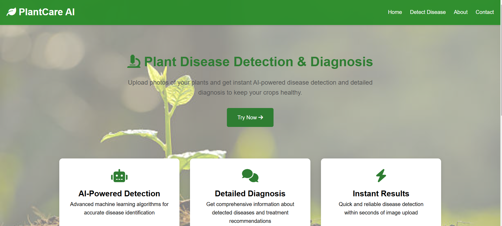

# PlantCare AI - Plant Disease Detection System

PlantCare AI is an intelligent plant disease detection and diagnosis system that combines computer vision with advanced language models to help farmers and gardeners identify and treat plant diseases effectively.



## Features

- **Accurate Disease Detection**: Utilizes YOLOv11-cls model trained on 17k+ grayscale plant images
- **Comprehensive Disease Coverage**: Supports 38 different classes covering various diseases across 14 crops
- **Intelligent Diagnosis**: Uses LLaMA model to provide detailed disease information and treatment recommendations
- **User-Friendly Interface**: Clean, responsive web interface for easy image upload and results viewing
- **Real-time Processing**: Quick disease detection and diagnosis delivery

## Technical Details

### Model Architecture
- **Detection Model**: YOLOv11-cls
- **Training Dataset**: PlantVillage Dataset (17,000+ grayscale images)
- **Model Performance**: 
  - Accuracy: 95%
  - F1 Score: 0.95
- **Language Model**: LLaMA for detailed disease diagnosis
- **Web Framework**: Django

### Supported Crops
- Apple
- Blueberry
- Cherry
- Corn (Maize)
- Grape
- Orange
- Peach
- Bell Pepper
- Potato
- Raspberry
- Soybean
- Squash
- Strawberry
- Tomato

## Installation

1. Clone the repository:
```bash
git clone https://github.com/yourusername/plantcare-ai.git
cd plantcare-ai
```

2. Create and activate virtual environment:
```bash
python -m venv venv
source venv/bin/activate  # On Windows: venv\Scripts\activate
```

3. Install dependencies:
```bash
pip install -r requirements.txt
```

4. Run migrations:
```bash
python manage.py migrate
```

5. Start the development server:
```bash
python manage.py runserver
```

## Usage

1. Navigate to the application in your web browser
2. Upload an image of the plant you want to analyze
3. Wait for the detection and diagnosis results
4. Review the detailed information and treatment recommendations

## Contributing

1. Fork the repository
2. Create your feature branch: `git checkout -b feature/new-feature`
3. Commit your changes: `git commit -am 'Add new feature'`
4. Push to the branch: `git push origin feature/new-feature`
5. Submit a pull request

## Acknowledgments

- [PlantVillage Dataset](https://github.com/spMohanty/PlantVillage-Dataset) for providing the training data
- YOLOv11-cls for the object detection architecture
- LLaMA model for providing detailed disease diagnosis
- Django framework for the web application


## Contact

For questions and support, please open an issue in the GitHub repository.
